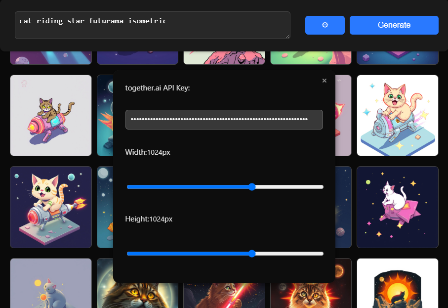
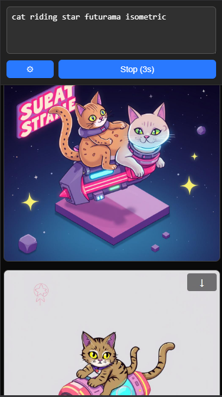

# Free Image Generation Web App

This is a simple web application that allows you to generate images using a free AI model from [together.ai](https://api.together.ai/). It's designed to be easy to use directly in your browser.

## Features:

*   **Free Image Generation:** Utilizes the `black-forest-labs/FLUX.1-schnell-Free` model from together.ai for image generation.
*   **Adjustable Image Size:**  You can set the width and height of the generated images in the settings.
*   **Settings Menu:** Includes a settings menu to input your together.ai API key and adjust image dimensions.
*   **Image History:**  Displays a history of generated images for easy access and download.
*   **Rate Limit Handling:**  Automatically waits for 10 seconds between image generation requests to respect the together.ai free model's rate limit (6 images per minute).
*   **Responsive Design:** Works well on both desktop and mobile devices.

## Screenshots:

**Desktop View:**

**Mobile View:**

## Usage Instructions:

1.  **Get an API Key:**
    *   You need an API key from [together.ai](https://api.together.ai/).
    *   Go to [https://api.together.ai/settings/api-keys](https://api.together.ai/settings/api-keys) and create an API key if you don't already have one.

2.  **Enter API Key in Settings:**
    *   Open the settings menu in the web app by clicking the "⚙" button.
    *   Paste your together.ai API key into the "together.ai API Key" input field.

3.  **Write a Prompt:**
    *   In the text area labeled "Enter your prompt here," type a description of the image you want to generate. Be descriptive for better results!

4.  **Generate Image:**
    *   Click the "Generate" button.
    *   The app will send your prompt to together.ai and generate an image.
    *   While generating, the "Generate" button will change to "Stop (0s)" with an indicator.

5.  **View Image History:**
    *   Generated images will appear in the "Image History" section below the controls.

6.  **Adjust Settings (Optional):**
    *   Open the settings menu to change:
        *   **API Key:** You can update or change your API key at any time.
        *   **Width:** Adjust the width of the generated image (in pixels).
        *   **Height:** Adjust the height of the generated image (in pixels).
    *   Click the "×" button in the settings menu to close it.

7.  **Download Images:**
    *   Hover over an image in the history. A download icon "↓" will appear in the top right corner.
    *   Click the download icon to save the image to your computer.

## Model and Rate Limits:

*   **Model:** This app uses the free `black-forest-labs/FLUX.1-schnell-Free` model provided by together.ai.
*   **Rate Limit:** The free model has a rate limit of approximately 6 image generations per minute.
*   **Automatic Waiting:**  The application automatically handles this rate limit by waiting for 10 seconds after each image generation request before allowing a new request. This helps ensure you don't exceed the limit and encounter errors.

##  GitHub Repository Link:

[https://github.com/qaziro/simple-ai-image-gen](https://github.com/qaziro/simple-ai-image-gen)

---

**Enjoy generating images!**
